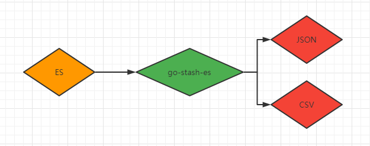

# go-stath-es简介
go-stash-es可以把elasticsearch数据导出到json、csv文件


### 支持
 - [x] es7
 - [ ] es8

### 安装
```
cd stash && go build stash.go
```

- 可执行文件方式
```shell
./stash -f etc/config.yaml
```

config.yaml示例如下:
```
ESConf:
  Name: go-stash-es
  Addr:
    - 'http://127.0.0.1:9200'
  Index: 'filebeat-*'
  Body: '{"query":{"match_all":{}}}'
  Size: 100  # query body size
  Username: root
  Password: root
Output:
  Target: json
  Filename: data.json
```